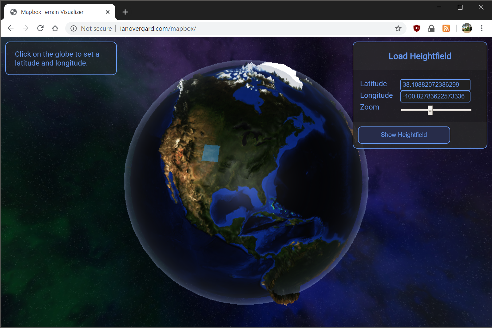
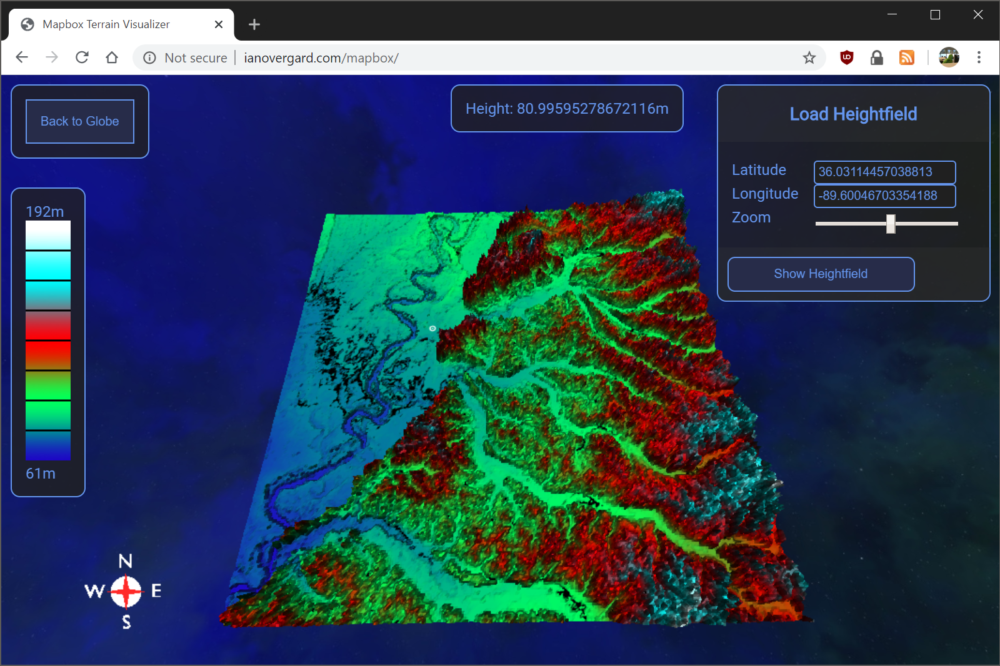

# Mapbox Terrain Visualizer

## WAT

This allows you to pick terrain tiles on a globe, and then view the heightmap. 

## Build

The easiest way to build from scratch is to run these commands:

    npm i
    npm run build-dev
    npm run start:dev

This should now be hosting a server on port 8080 
